# 02-矩阵消元

## 1、Overview (概述)

在本节中，我们主要介绍 <b>消元法 (Elimination)</b> ，也就是我们在上一节中提到的 “系统化” 求解方程所用的方法。通过矩阵的消元运算可以很轻松地求解复杂方程。

后半部分还介绍了 <b>消元矩阵</b>，即我们的消元运算在矩阵乘法中所表现的形式。并从消元矩阵引入，介绍了一些 <b>逆矩阵</b> 的基础知识。

## 2、使用 消元法 求解方程

### 2.1、消元法介绍

能够使用消元法分为以下 2 种情况: 
* 成功: 矩阵的主元不包含 0， 也就是说，可逆矩阵。
* 失败: 举着的主元有至少一个 0，也就是说，不可逆矩阵。

对于一些 “好” 的系数矩阵（可逆矩阵） A 来说，我们可以使用消元法来求解方程 <b>Ax=b</b> ，我们还是从一个例子谈起。

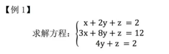

我们仍然使用矩阵计算，将方程写为矩阵形式 <b>Ax=b</b> 。如下: 

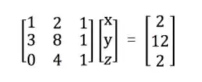

所谓矩阵的消元法，其实与我们在初等数学中学习的解二元一次方程组的消元法同理，都是通过将不同行的方程进行消元运算来简化方程，最后能得到简化的方程组。只不过这里我们把 <b>系数</b> 单独抽出来进行运算，寻找一种 <b>矩阵</b> 情况下的普遍规律而已。

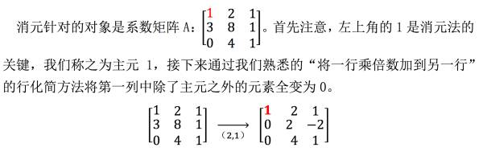

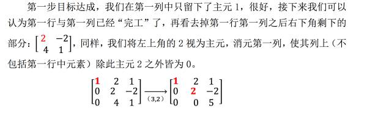


```
注：

并不是所有的 A 矩阵都可消元处理，需要注意在我们消元过程中，如果主元位置（左上角）为 0，
那么意味着这个主元不可取，需要进行 “换行” 处理：

首先看它的下一行对应位置是不是 0，如果不是，就将这两行位置互换，将非零数视为主元。
如果是，就再看下下行，以此类推。若其下面每一行都看到了，仍然没有非零数的话，那就意味着这个矩阵不可逆，
消元法求出的解不唯一。
```

下面是 3 个例子: 

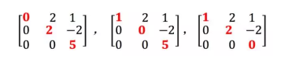

### 2.2、回带求解

其实回带求解应该和消元法同时进行，只不过在我们讲解的时候以及在一些软件工作原理中它们是先后进行的，所以我们这里分开讨论，下面我们首先介绍—— **增广矩阵**。

仍然是上面例一中我们给出的方程，  ，我们接下来首先给出 **增广矩阵** 形式: 

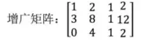

可以一下就看出来，**增广矩阵** 就是把 **系数矩阵 A** 和 **向量 b** 拼接成一个矩阵就行了。

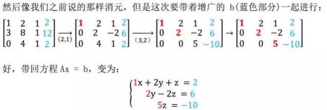

从上向下开始求解，很容易求出 **x, y, z** 的值了。


## 3、消元矩阵

### 3.1、行向量与矩阵乘法

上面的消元法是从简单的变换角度介绍了消元的具体操作，接下来我们需要用矩阵来表示变换的步骤，这也十分有必要，因为这是一种 “系统地” 变换矩阵的方法。

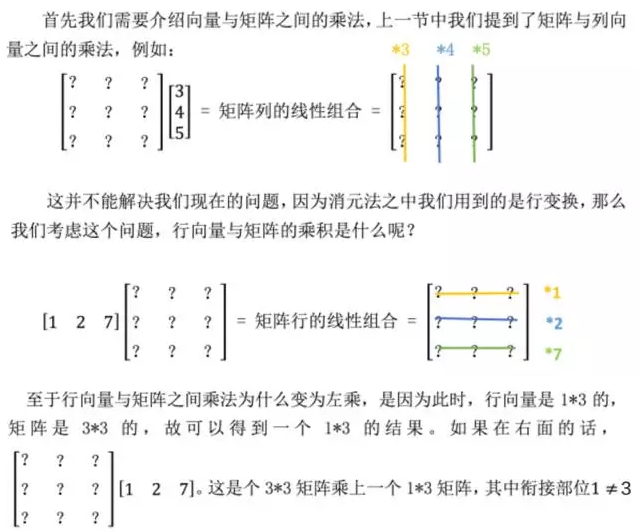

导致错误。其实学过矩阵之间的乘法之后这些东西都极为简单，但这里还是建议大家尽量从向量的角度去考虑问题。

### 3.2、消元矩阵介绍

好的，接下来是重点。学会了行向量与矩阵之间的乘法，我们就可以使用行向量对矩阵的行做操作了。所谓 **消元矩阵，就是将消元过程中的行变换转化为矩阵之间的乘法形式**。

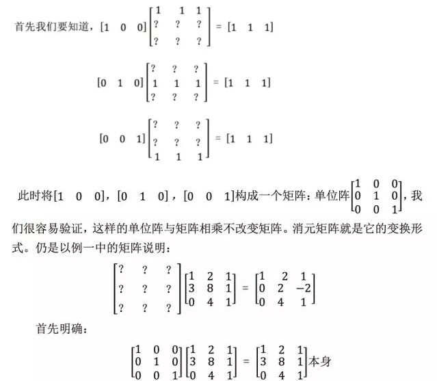

我们消元过程是将第一行 乘以 -3 加到 第二行，这是对第二行的操作，那么就从单位阵的第二行着手: 

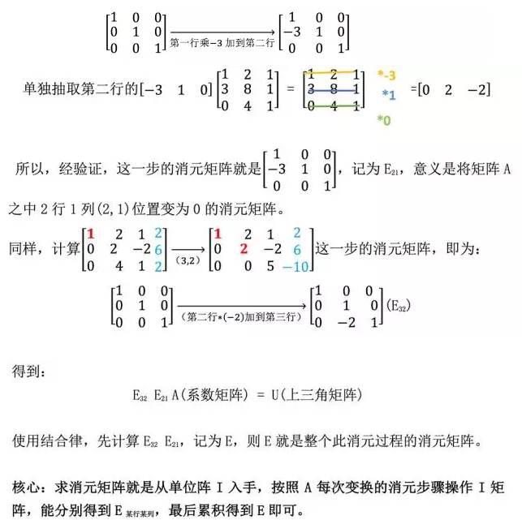

### 3.3.1、行变换和列变换

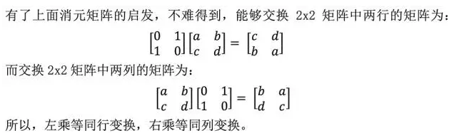

### 3.3.2、逆矩阵初探

可以说我们学会了消元矩阵，就相当于我们可以用矩阵乘法对一个矩阵进行任何变化了，那么我们考虑一个反过程，即我们把一个消元结束的 **矩阵 U** 如何变为 未经消元的 **矩阵 A** 呢？

答案就是 **乘上一个逆矩阵**。

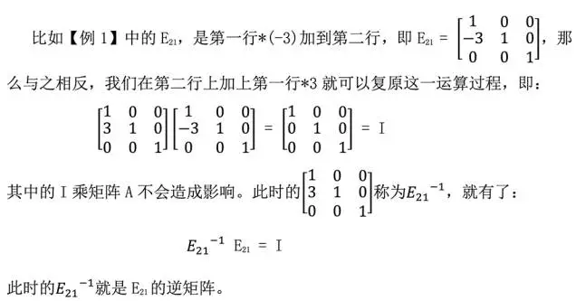

## 4、小结

这一个章节，我们从矩阵消元的角度，介绍解方程的通用做法，并介绍了消元矩阵，使我们从矩阵乘法层面理解了消元的过程，并延伸了消元矩阵的应用: 就是基于单位阵 I 的变化，对矩阵 A 进行行列变换的过程。

本章节的消元法以后会常用到，要熟练掌握才可以。

【[上一章：01-方程组的几何解释](../01-方程组的几何解释/01-方程组的几何解释.md)】【[下一章：03-乘法和逆矩阵](../03-乘法和逆矩阵/03-乘法和逆矩阵.md)】
