# 04-A 的 LU 分解

## 1、Overview（概述）

在上一篇 [03-乘法和逆矩阵](https://github.com/chenyyx/notes-linear-algebra/blob/master/03-%E4%B9%98%E6%B3%95%E5%92%8C%E9%80%86%E7%9F%A9%E9%98%B5/03-%E4%B9%98%E6%B3%95%E5%92%8C%E9%80%86%E7%9F%A9%E9%98%B5.md) 中，我们在末尾介绍了 **逆矩阵** 的一些内容，今天我们首先完善之前讲到的 **逆矩阵** 的内容，然后使用 **消元矩阵** 介绍 A 的 LU 分解，即: 将矩阵 A 分解为 矩阵 L 与上三角矩阵 U ，介绍这种运算的普遍规律。

最后我们再一次提起之前介绍过的 “行交换矩阵”，引入 置换矩阵 概念。

## 2、逆矩阵性质补充

首先，我们考虑一个问题: 方阵 A, B 都是可逆矩阵的话， AB 的逆矩阵是什么呢？这个问题并不复杂，想求出逆矩阵，无非就是令 **AB*逆矩阵 = I** ，而我们不难想到， 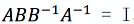 。所以有下面: 

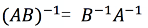

由于我们的下一章要涉及到矩阵的转置问题，我们在这里一并讨论矩阵转置与矩阵的逆的关系。

### 2.1、转置矩阵基础
首先介绍一下转置矩阵，转置矩阵就是将原矩阵各行换成对应列，所得到的新矩阵，如: 

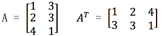

看起来就像是沿着左上角开始的一条对角线翻折了一样。

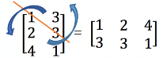

### 2.2、转置矩阵和逆矩阵的关系

上面我们介绍完了转置矩阵的基础，接下来看一看它和逆矩阵有什么联系？（我倒要看看你葫芦里卖的什么药）。

说到 逆矩阵，最经典的式子无非就是 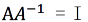 。为了找到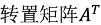 与 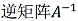 之间的关系。我们对  两边同时进行转置运算，得到 

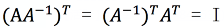

为什么 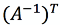 会变换到  的前面来呢？我们想象一下，最后乘积所得的单位矩阵 I 中每个元素都是由 A 的行向量与 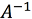 的列向量构成，当做转置运算时，I 沿对角线翻折，可以理解为整个乘法运算图形也要沿着 I 的对角线进行翻折，这样就解释了  的原因。

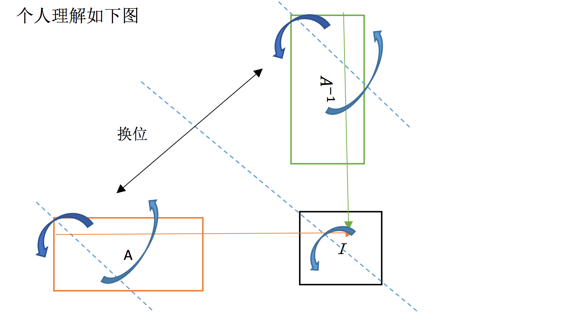

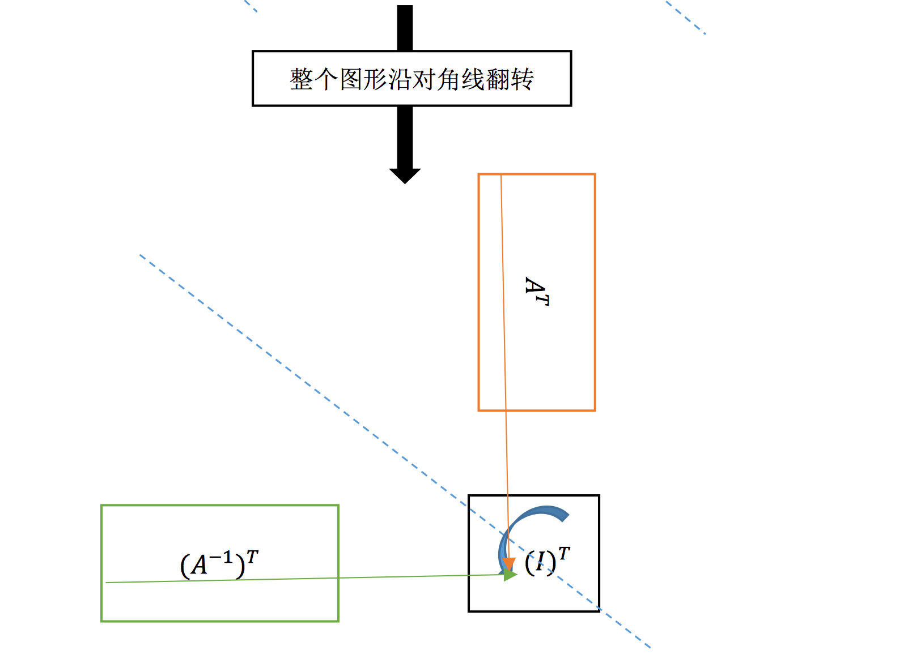

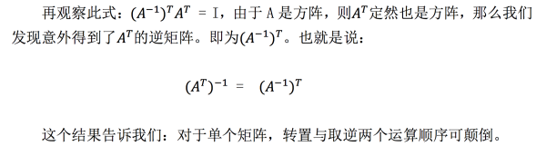

## 3、A 的 LU 分解

我们熟悉的消元法都是直接使用行变换得来的。而由于消元矩阵的存在，说明用矩阵乘法也可以达到与之一样的消元效果。所以，现在的假设有可逆矩阵 A ，若有 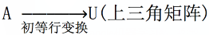 。就一定有类似于这样的形式: 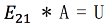 的等式存在，使 A 相当于进行了初等行变换成为 U 。而我们已经学习了逆矩阵， 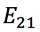 这样的矩阵一定有逆矩阵，因为它本身就是单位阵变化过来的。所以原式可以改写成: 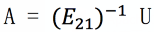 。这一形式即为 A = LU 形式，这个过程就是分解过程。

那么矩阵 L 是不是有什么特殊之处呢？我们通过下面一道例题来探讨一下。

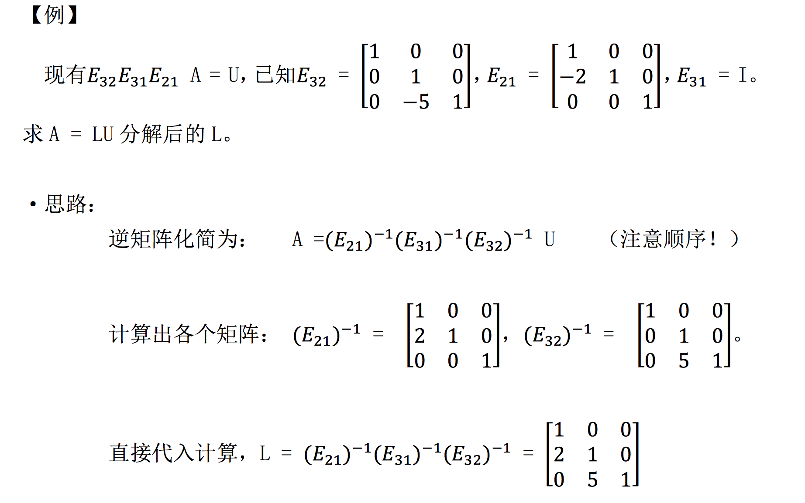

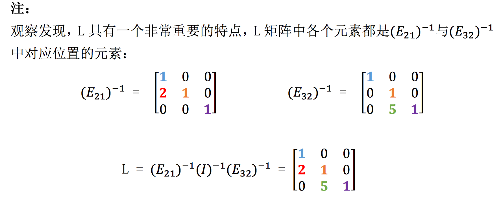

这就给了我们启示，在使用 A = LU 分解矩阵的时候，我们只需要从 U 入 手，反过来考虑，看如何通过行变换可以将上三角矩阵 U 变为 L，然后再将单位阵按此形式变化，就得到了 L 矩阵。这个性质也是 A = LU 形式分解矩阵的 最大优点，我们甚至不需要知道类似的值到底是什么，我们只需要知道变换形式， 即可求出 L，写出 A = LU 等式。

以上，我们已经学会了 A = LU 分解矩阵方法，那么现在有一个额外问题，就 是消元的运算量问题，比如现在我们有一个 100*100 的超级大的矩阵(无 0 元素）。

我们需要运算（将一行乘一定倍数后加到另一行上消元，每一个这样的过程计为 一次运算）多少次之后，才能将其化为上三角矩阵 U 呢？

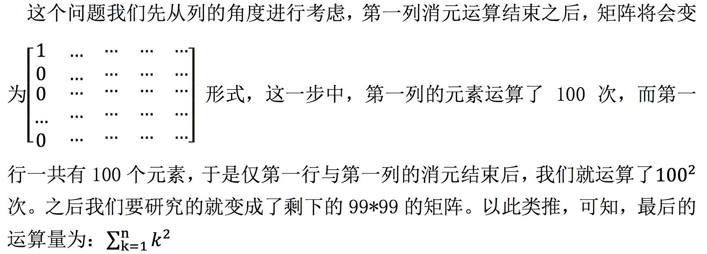

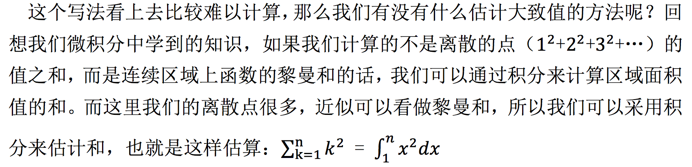

## 4、置换矩阵

百度百科上对于 **置换矩阵** 的定义：在数学上，特别是在矩阵理论中，置换矩阵是一个方形二进制矩阵，它在每行和每列中只有一个1，而在其他地方则为0。

我们之前接触过行变换所用到的矩阵，即是将单位阵 I 按照对应行变换方式进 行操作之后得到的矩阵。它可以交换矩阵中的两行，代替矩阵行变换。什么时候 我们需要使用矩阵行变换呢？一个经典的例子就是：在消元过程中，当矩阵主元 位置上面不是 1 时，我们就需要用行变换将主元位置换回 1。

这样的由单位阵变换而来的矩阵，通过矩阵乘法可以使被乘矩阵行交换。我们 将这样的矩阵称为置换矩阵 P。我们通过一个例子来熟悉一下置换矩阵。

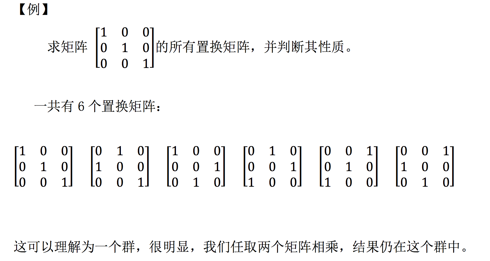

注：

推广到 n 阶矩阵，n 阶矩阵有 n！个置换矩阵，就是将单位矩阵 I 各行重新排列后所有可能的情况数量。我自己的理解是：单看第一行，有 n 种排列方式， 再看除去第一行，第一列的(n-1)阶矩阵，再看其第一行，有(n-1)种排列方式。 以此类推，直到最后的 1 阶，有 1 种排列方式，由乘法原理，就有了 n!个置换 矩阵。

## 5、小结

线性代数的前面这部分基本是一些技巧的运算。本节我们对矩阵的转置，逆矩阵性质进行了部分介绍，学习了矩阵的 A = LU 分解，了解了这种分解方式的优点所在，并学会了直接构造 L 矩阵，简化消元过程。**这些技巧与知识都是我们接下来学习的重要基础**。

【[上一章：03-乘法和逆矩阵](../03-乘法和逆矩阵/03-乘法和逆矩阵.md)】【[下一章：05-转置，置换，向量空间R](../05-转置-置换-向量空间R/05-转置-置换-向量空间R.md)】
