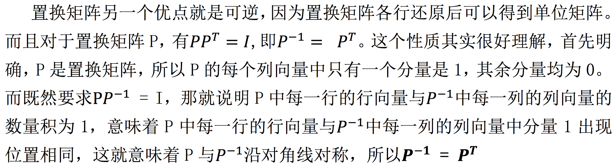
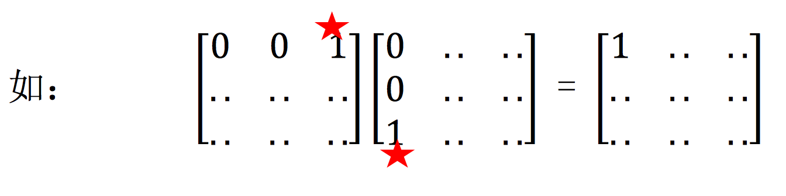
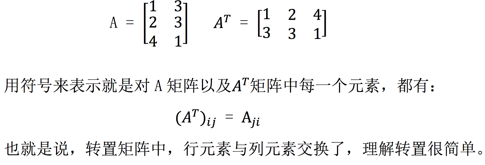
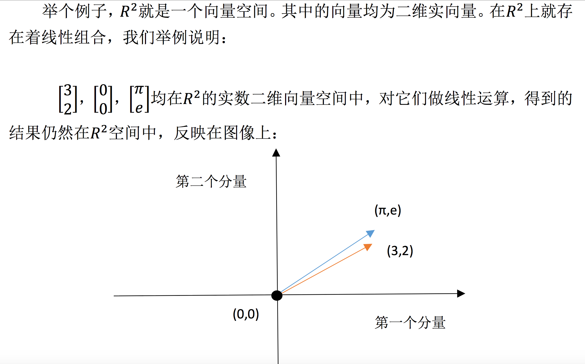
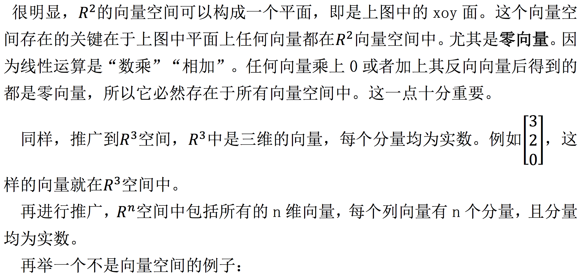
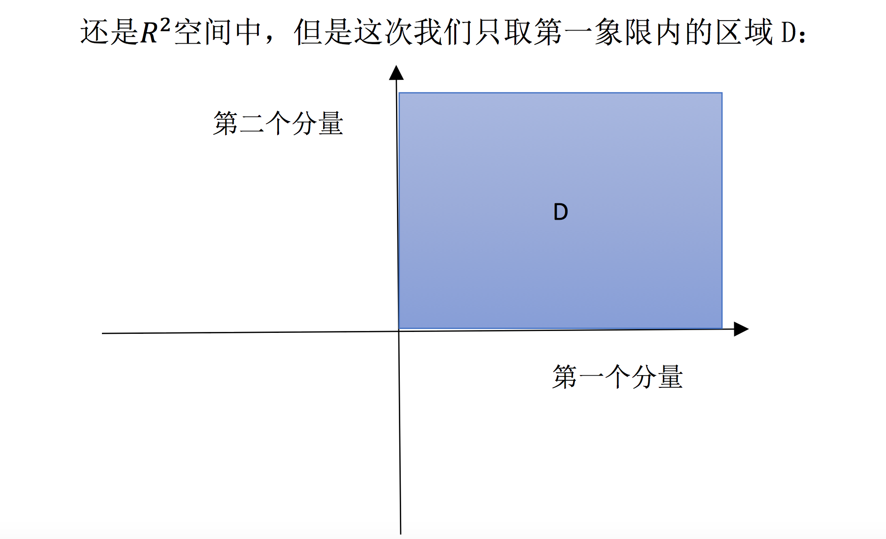
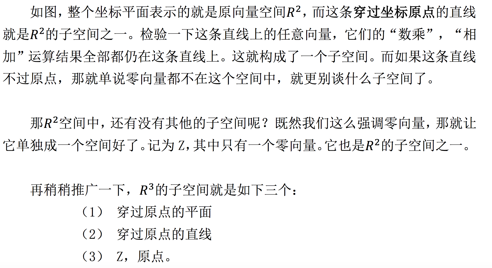
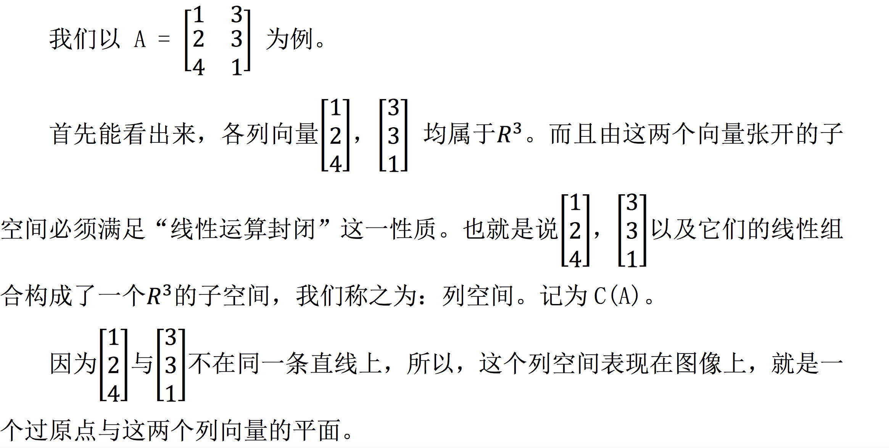
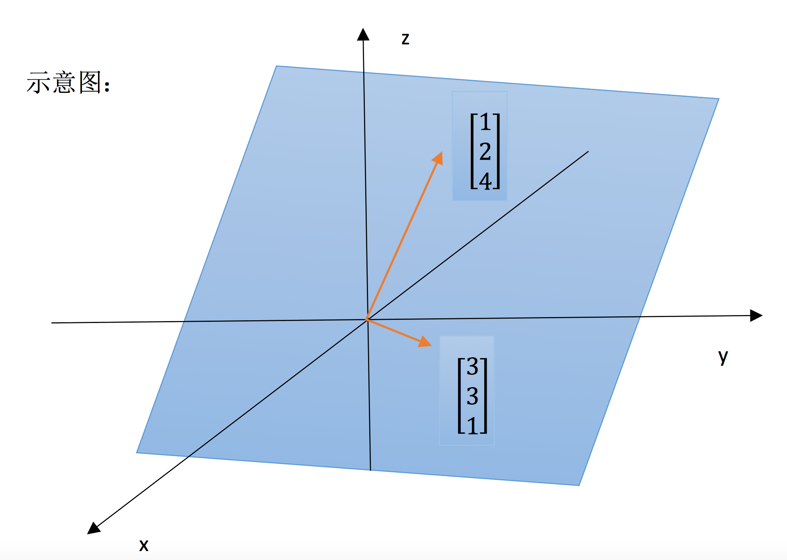
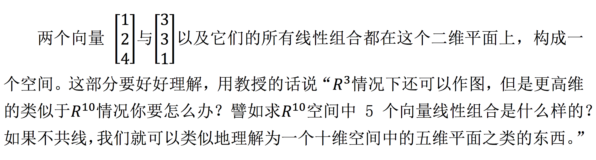

# 05-转置、置换、向量空间 R

## 1、Overview（概述）

在上一节 [04-A 的 LU 分解](https://github.com/apachecn/math/blob/master/04-A%E7%9A%84LU%E5%88%86%E8%A7%A3/04-A%E7%9A%84LU%E5%88%86%E8%A7%A3.md) 中，我们谈到了 **置换矩阵** 和 **转置矩阵** ，这一节，我们再谈 **置换矩阵** 和 **转置矩阵** 它们两个，并完善之前讲过的内容，并简要介绍 **对称阵**。之后便进入学习 **linear-algebra （线性代数）** 的关键所在 —— **向量空间** 与 **子空间**。

## 2、置换矩阵

### 2.1、置换矩阵回顾
所谓的置换矩阵 P，就是用来完成行交换的矩阵，更具体来讲，是行重新排列了的单位矩阵。例如， I 就是一个置换矩阵，只不过 I 对矩阵没影响（因为矩阵乘以单位阵还等于原来的矩阵，没有发生改变）。

那么对于 n 阶矩阵来说，有多少个置换矩阵呢？答案是： n! 种，也就是将单位阵 I 各行重新排列后所有可能的情况的数量。

### 2.2、置换矩阵的使用
在讲消元法的时候，主元位置为 0 是一件很让人头疼的事情，这时就需要考虑 **置换矩阵 P**来完成行交换，确保消元过程顺利进行。上一节我们学习 **A = LU** 分解时，我们没有考虑要交换行的过程，如果我们想写出更加普适的 LU 分解式的话，必须把 行交换 情况考虑进去，即: 

PA = LU

先用 行交换 使得主元位置不为 0，行顺序正确。其后，再用 LU 分解。

## 3、转置矩阵

### 3.1、转置矩阵回顾

之前简单介绍过转置矩阵，即

### 3.2、对称阵

对称矩阵，顾名思义，就是对角线两侧元素对应相等的矩阵。或者说，对 矩阵 A ，如果有: 

## 4、向量空间与子空间

### 4.1、向量空间
首先我们需要明确 “向量空间” 的概念，它表示一整个空间的向量，但是要注意，不是任意向量的集合都能被称为 向量空间。所谓的向量空间，必须满足一定规则，就是: 该空间对线性运算（相加，数乘）封闭。类似: v -> 3v 或者 v, w -> v+w 运算，若得到的  3v 或者 v+w 都仍然在此空间中，那么这个空间可称为向量空间。

很明显，这部分空间无法满足 “线性组合仍在空间中” 的要求，比如 数乘运算 时，随便取个负数，向量就跑到第三象限去，脱离 D 空间范围内了。

### 4.2、子空间
上面的反例已经证明了。在向量空间里随便取其一部分，很可能得到的不是 向量空间。那如果我们取向量空间的一部分，将其打乱，构成的有没有可能是 向量空间 呢？

### 4.3、列空间的简要介绍
上面介绍的子空间都是基于已知的图像来寻找的，接下来我们来通过具体的矩阵来构造出一个子空间，比如: 列向量构造出的列空间。

这里还需要注意列向量之间的性质，如果列向量之间就是共线的，那么其列空间就是一条过原点的直线。

## 5、小结

本节算是结束了之前部分对基本运算和基本概念的介绍。介绍了 **向量空间** 和 **子空间**，并由子空间引出了**通过具体的列向量构成的空间 —— 列空间**。如何理解 **空间** 十分重要，本节中对低维的空间做了图，目的主要是便于我们理解 “**空间**” 这一概念。

【[上一章：04-A 的 LU 分解](../04-A的LU分解/04-A的LU分解.md)】【[下一章：06-列空间和零空间](../06-列空间和零空间/06-列空间和零空间.md)】
