# 06-列空间和零空间

## 1、Overview（概述）

本节从我们上一节 [05-转置-置换-向量空间R](https://github.com/apachecn/math/blob/master/05-%E8%BD%AC%E7%BD%AE-%E7%BD%AE%E6%8D%A2-%E5%90%91%E9%87%8F%E7%A9%BA%E9%97%B4R/05-%E8%BD%AC%E7%BD%AE-%E7%BD%AE%E6%8D%A2-%E5%90%91%E9%87%8F%E7%A9%BA%E9%97%B4R.md) 中介绍的 **子空间** 开始，介绍了 **子空间** 的部分性质。并重点介绍了 **列空间 与 方程 Ax=b 之间的联系**。并由此引出了 **零空间** ，根据 Ax=b 这个方程给出了两种**构建子空间**的方法。

## 2、子空间

### 2.1、子空间回顾

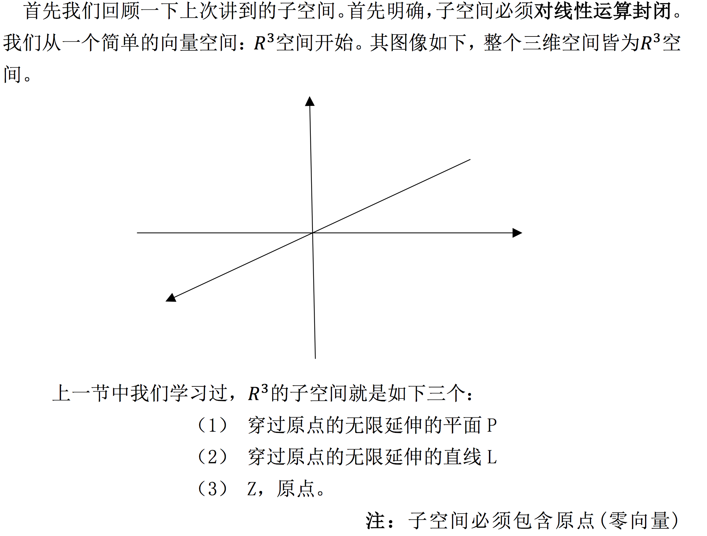

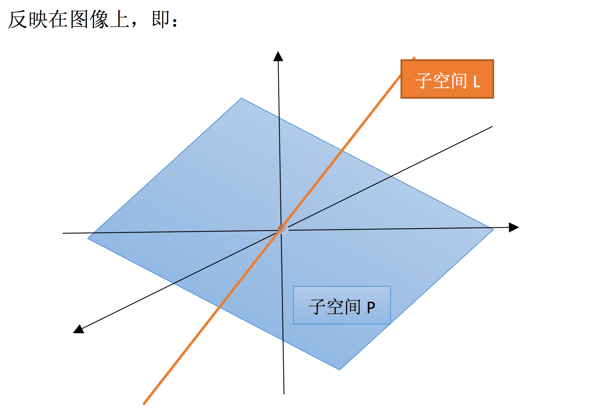

很明显，**子空间直线 L** 或 **平面 P** 上，任取两个向量相加，得到的向量仍在该子空间中。而且将其上的向量做数乘伸长或缩短一定倍数，其结果也还在该子空间中。所以它们都对线性运算封闭。

### 2.2、子空间的 “交” 与 “并”

上面我们都是分别研究的两个子空间，那么接下来我们对两个空间之间联系部分展开讨论。

#### 2.2.1、P∪L 空间
还是讨论上面𝑅 3 的子空间 P 与 L，首先要研究的就是它们的并空间，即：现有一集合，包含了 P 与 L 中的所有向量，那么这个集合是子空间吗？

答案是否定的。

很明显，我们将直线 L 与平面 P 看做同一个集合 P∪L 之后,这个集合**对线性运算并不封闭**。比如我们随便在直线 L 上取一个向量 a，在平面 P 上取一个向量 b。此时向量 a+b 方向就会夹在直线 L 与平面 P 之间，脱离了 P∪L 的范围。所以 P∪L 无法构成空间。 

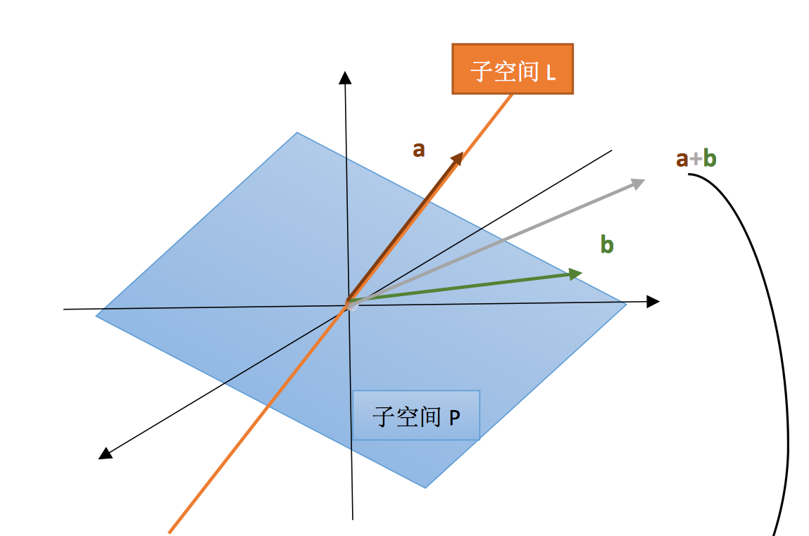

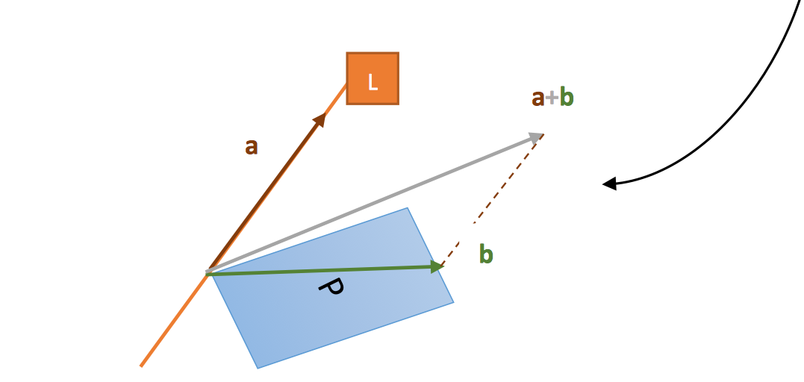

#### 2.2.2、P∩L 空间

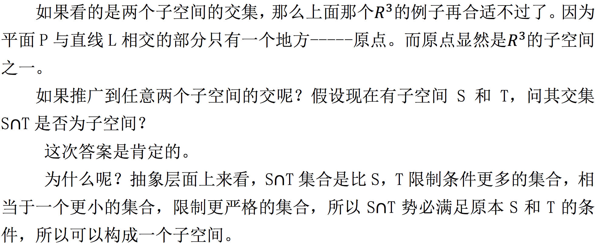

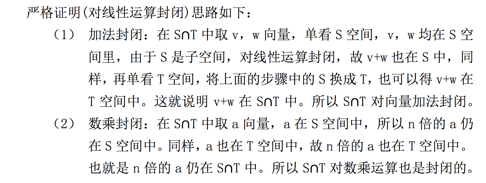

## 3、列空间

### 3.1、列空间回顾

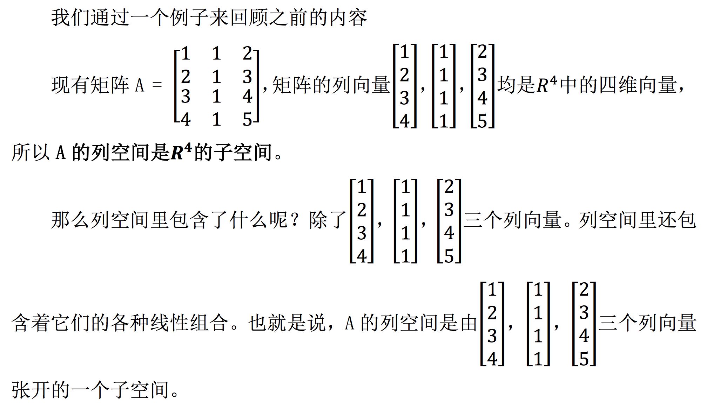

那么这个子空间有多大呢？这就需要用 Ax = b 方程来解释了。

### 3.2、 Ax = b 的空间解释（从 A 的角度）

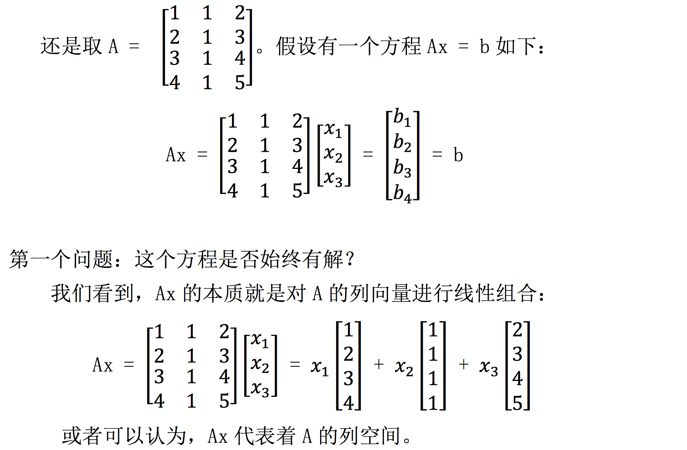

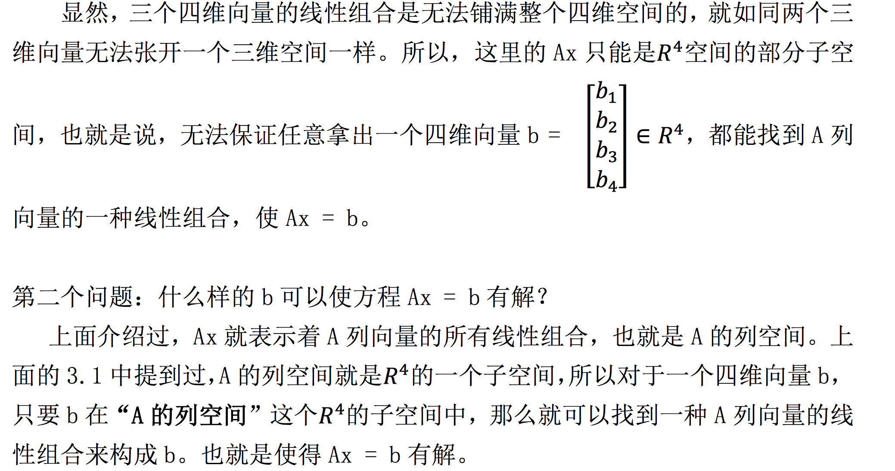

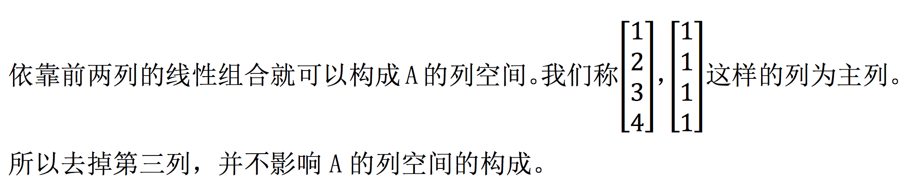

## 4、零空间

### 4.1、零空间介绍

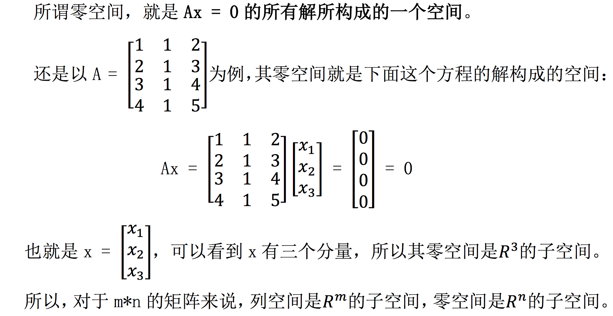

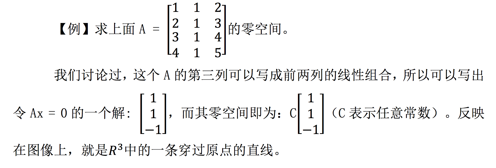

### 4.2、Ax = b 的空间解释(从 x 的角度)

那如果上面构造零空间的方程右侧变为任意向量的话，其解集 x 还能构成 向量空间 吗？

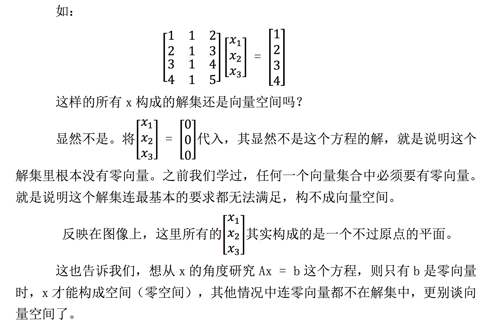

## 5、小结

在本节中我们学习了**列空间**与**零空间**。从 Ax = b 入手，给出了**两种构建子空间**的方法:
1. 从 A 的列向量入手，已知列向量，根据其线性组合构造空间。
2. 从 Ax = 0 方程组入手，一开始并不知道 x 中有什么向量，只是根据 Ax = 0 这个方程构造方程组，让 x 满足特定条件来构造子空间。

这两种构造子空间的方法需要掌握。其实就是一个从 A 的列向量入手，一个从 x 的解集入手构建子空间的问题。

【[上一章：05-转置，置换，向量空间R](../05-转置-置换-向量空间R/05-转置-置换-向量空间R.md)】【[下一章：07-求解Ax=0、主变量、特解](../07-求解Ax=0-主变量-特解/07-求解Ax=0-主变量-特解.md)】
