# 07-求解Ax=0-主变量-特解

## 1、Overview（概述）

上一节我们讨论了列空间和零空间的相关问题，那么这一节我们从它们的定义过渡到它们的计算，即如何求解出这些空间的一般形式。给出一种可以解出 Ax=0 中的 x 构成的零空间的算法。

## 2、消元法求解零空间

在之前讲解 [使用消元法求解方程组 Ax=b](https://github.com/chenyyx/math/blob/master/02-%E7%9F%A9%E9%98%B5%E6%B6%88%E5%85%83/02-%E7%9F%A9%E9%98%B5%E6%B6%88%E5%85%83.md) 时，我们对一种情况是无法处理的，那就是矩阵 A 不可逆的情况。之前对这种情况的解释是：求出的解不唯一。这正好对应了我们现在学到的 “空间” 概念。

我们从最简单的零空间（b = 0）的计算谈起。

### 2.1、消元法确定主变量与自由变量（消元）

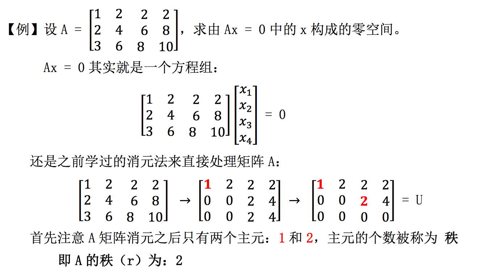

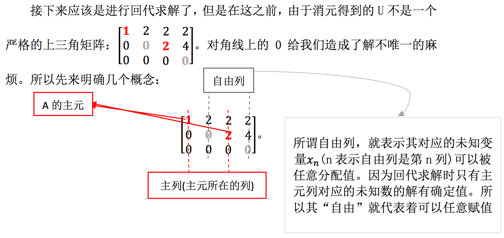

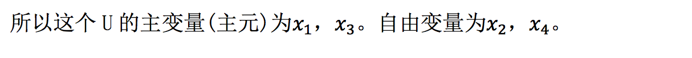

### 2.2、对自由变量赋值覆盖零空间（回代）

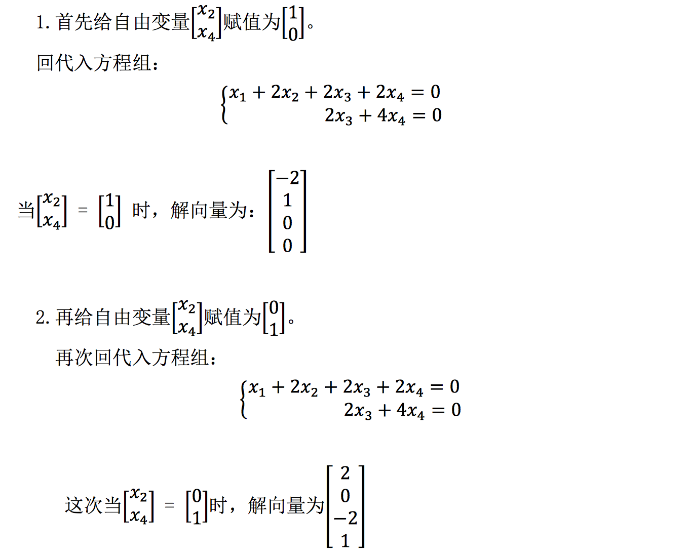

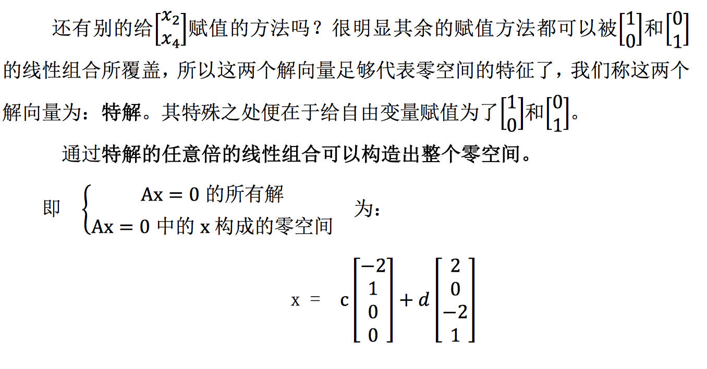

### 2.3、算法总结

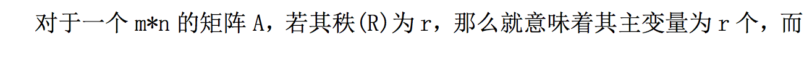

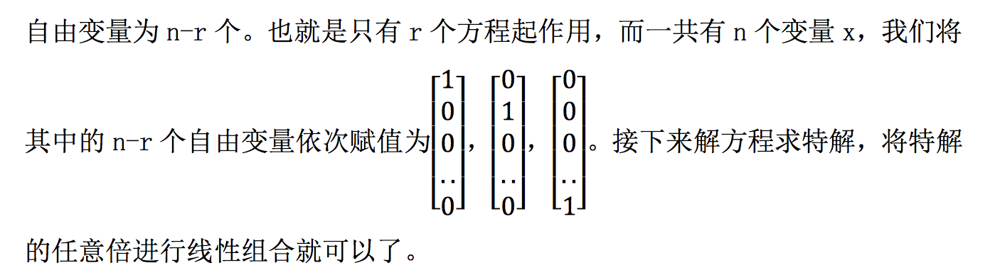

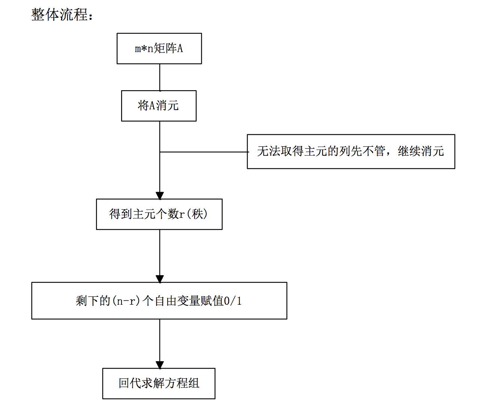

## 3、简化行阶梯形式

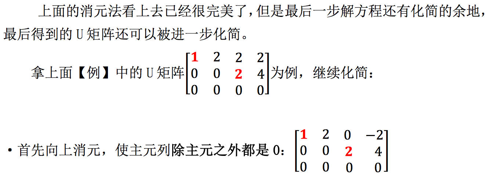

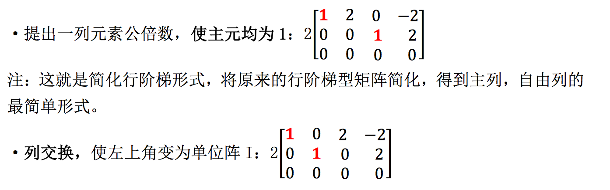

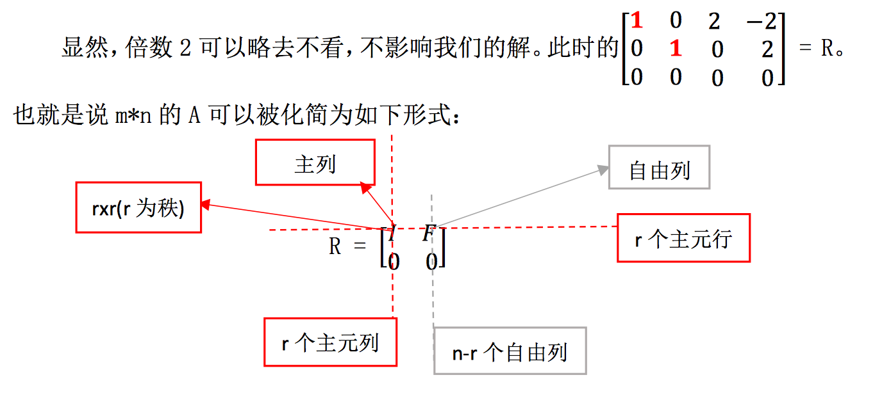

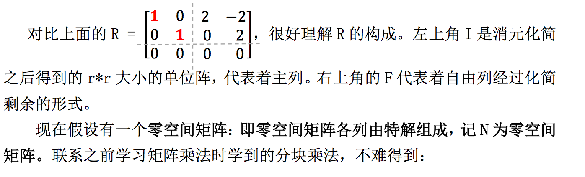

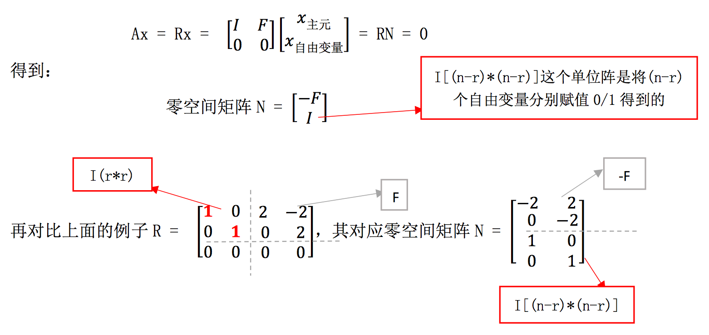

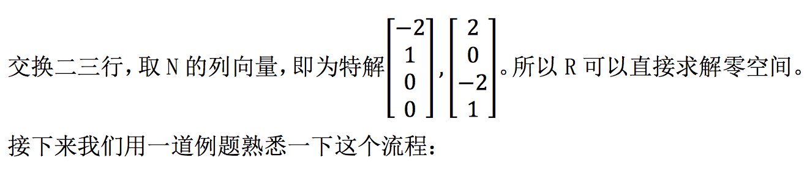

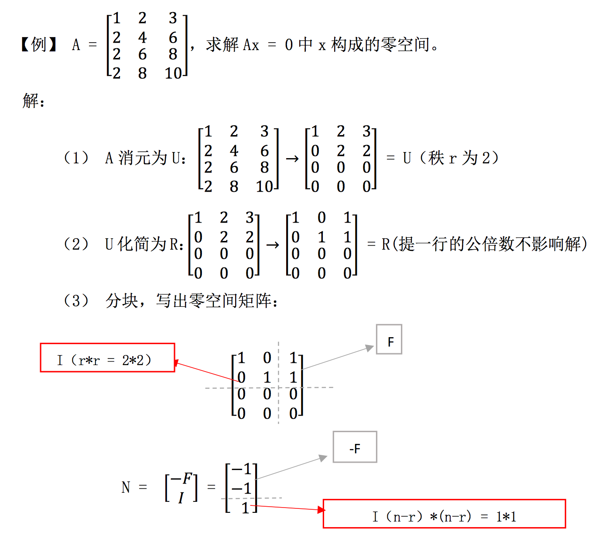

## 4、小结

这节学习的是计算 Ax = 0 中的 x 构成的零空间的方法，即：消元，找主变量与自由变量，为自由变量赋值，得到特解，特解线性组合得到零空间。后面又介绍了化简 U 变为 R，直接利用 R 的结构得到零空间矩阵 N 的方法。这节重在计算流程，需要加以练习才可以熟练掌握。

【[上一章：06-列空间和零空间](../06-列空间和零空间/06-列空间和零空间.md)】【[下一章/08-求解Ax=b、可解性和解的结构](../08-求解Ax=b-可解性和解的结构/08-求解Ax=b-可解性和解的结构.md)】
