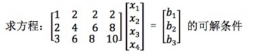

# 08-求解 Ax=b 可解性和解的结构

## 1、Overview(概述)

上一节我们首先讨论了矩阵，然后学习到了从矩阵引出的空间的概念，并且学习了 Ax=0 的求解过程。这一节中我们将进一步来探讨，给出求解 Ax=b 的一般求解方法以及可解条件。并总结上一节中提到的 “秩” 对不同形式方程的解的影响。

## 2、Ax=b 的解

### 2.1、可解性

这节我们要介绍如何来解 Ax=b ，但是这个方程并不一定有解。我们通过一个例子来说明下这个问题: 

【例1】

这里的 A 有一个特点，就是 1, 2 两行之和等于第三行。根据之前学到的技巧（[02-矩阵消元](https://github.com/apachecn/math/blob/master/02-%E7%9F%A9%E9%98%B5%E6%B6%88%E5%85%83/02-%E7%9F%A9%E9%98%B5%E6%B6%88%E5%85%83.md) 的增广消元法），列增广矩阵后消元，由于之前写过比较详细的消元步骤，