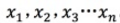
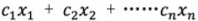
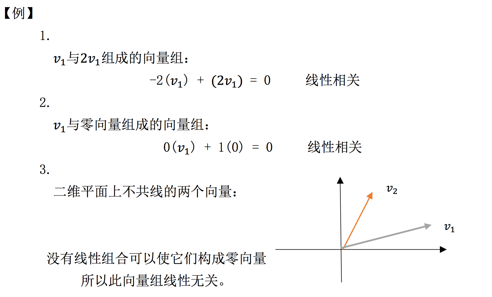
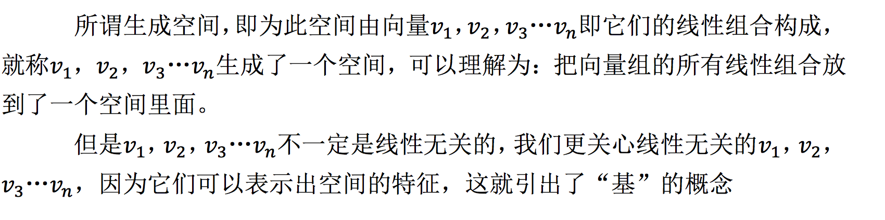
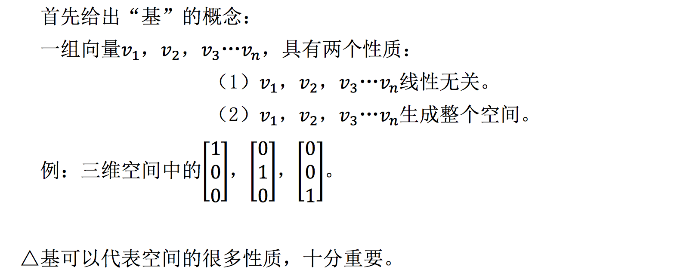
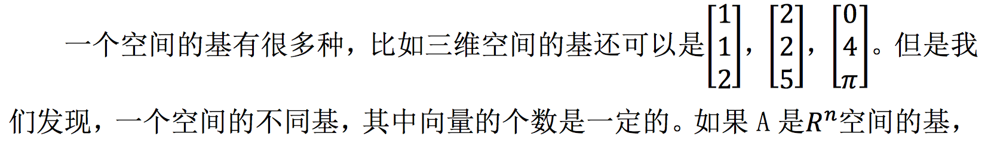
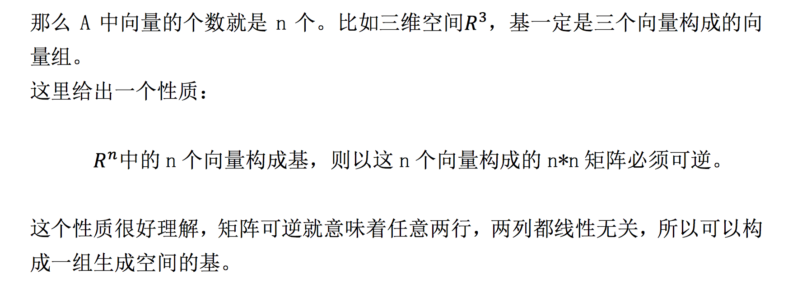
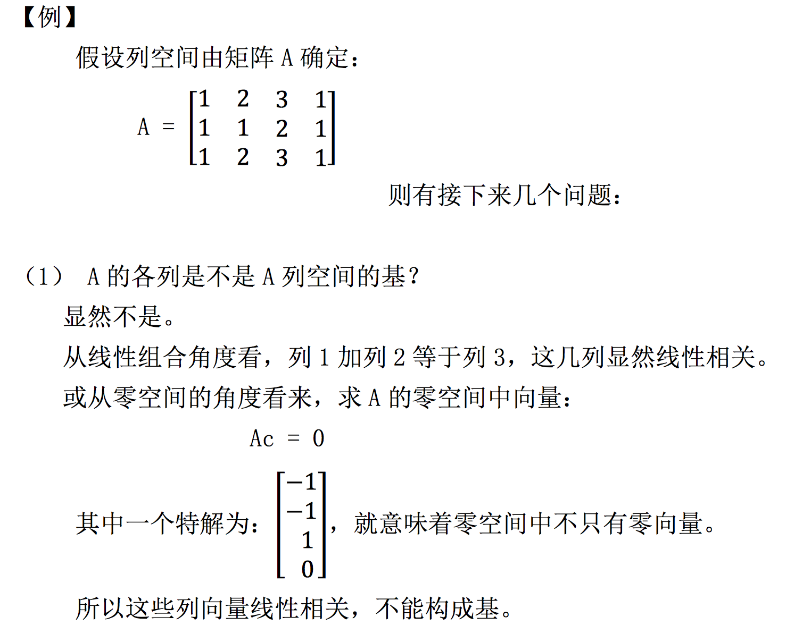
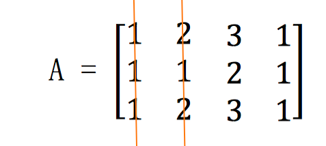
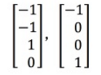

# 09-线性相关性-基-维数

## 1、Overview（概述）

在之前的章节中，我们可能经常会发现矩阵中有时会有一行或几行本身就是前面几行的线性组合的情况，那么这一节，我们就从这种线性相关或线性无关的特征入手，介绍空间中的几个重要的概念：**基** ， **维数** 。

## 2、线性无关和线性相关

### 2.1、背景知识

首先需要强调的是，接下来我们讨论的概念都是基于向量组的，而不是基于矩阵的。线性无关，线性相关都是向量组内的关系，基也是一个向量组，不要与矩阵概念混淆。

首先我们从之前学习的 Ax=0 方程谈起。

例如 m*n 的矩阵 A :

显然，n > m，以这样的矩阵 A 构成的方程 Ax = 0，此时未知数𝑥 𝑛 的个数比 方程的个数多。未知数一共 n 个，方程一共 m 个。

所以此时 A 的零空间中除零向量以外还有其他向量，原因是这样的 A 一定有自由变量(至少有 n-m 个自由变量)，这就造成了零空间中向量的无穷解。

### 2.2、线性无关与线性相关

我们之前也接触了线性无关与线性相关的相关概念。接下来直接给出定义：

#### 2.2.1、线性无关

除系数全为 0 的情况外，没有其他线性组合方式能得到零向量，则这组向量线性无关。

设向量组为  。即 c 不全为 0 时，任何  线性组合的结果都不为零，则此向量线性无关。

#### 2.2.2、线性相关

除了零组合之外还有其他的线性组合方式得到零向量，则这组向量线性相关。

注意：如果一个向量组中有零向量存在，那么这个向量组一定是线性相关的。

举几个例子感受一下上面的概念：

显然，A 矩阵是 n > m 型的矩阵。而根据我们的背景知识 (2.1)， Ac = 0 这个方程对应的零空间中，除了零空间肯定还有其他向量，也就是存在一种 c 不全为 0 的情况，使 A 各列线性组合后得到 0 。也就是 A 各列的  线性相关。

很明显，【例 1】 将线性相关与线性无关与零空间联系了起来。

### 2.3、零空间的作用

根据上面的例题 4 ，我们再从矩阵的零空间与矩阵列向量角度重新定义向量组的线性相关/无关。假设现有一 m*n 矩阵 A：

* 如果 A 各列向量构成的向量组是线性无关的，那么矩阵 A 的零空间中只有零向量。

* 如果 A 各列向量构成的向量组是线性相关的，那么矩阵 A 零空间中除零向量之外还一定有其他向量。

很好理解上面零空间角度的定义。因为零空间反映的就是 A 各列向量的线性组合。

**从秩的角度看来：**

* 线性无关对应向量组构成的矩阵，秩为 n，此时没有自由变量，零空间中只有零向量存在。

* 线性相关对应向量组构成的矩阵，秩小于 n，有 n-r 个自由变量，零空间中有很多向量。

### 2.4、生成空间

## 3、基

## 4、维数

上面介绍基的时候提到了 “𝑅 𝑛 空间的基中向量个数为 n 个”。这个 “n” 我们称之为维数。同一个空间内，即使基不同，基向量的个数也必须相等。

理解维数也很简单，像我们的三维空间，其基一定是三个三维向量（三个向量，每个向量有三个分量），四维空间的基也一定是四个四维向量。

## 5、回顾一下

这一节学习了很多概念问题，我们通过下面的一个例题来回顾一下。

(2) 找出 A 列空间中的一个基

从 A 的结构看来：

第3列 = 第1列 + 第2列
第4列 = 第1列

显然，我们可以取前两列作为基。所以 A 的列空间的维数为：2。再看 A 矩阵，显然 A 的秩为 2，消元后只有两个主列。所以有：

矩阵 A 的秩 = 矩阵 A 主列的个数 = A 列空间维数

这下我们就将矩阵的秩与列空间的维数联系了起来，而更重要的是，我们知道了列空间的维数，那么在这个列空间中随便找两个线性无关的向量，它们就可以构成一组基，这组基就可以生成这个列空间。

(3) A 对应零空间的维数为多少？

所谓零空间维数，即是零空间基的个数，也是 Ax=0 的特解的个数，还可以理解为： Ax=0 的解中自由变量的个数。

最简单的方法是解 Ax=0 这个方程。经过消元，自由变量赋值，回代，最后得到两个特解：

所以此零空间的维数为 2.

类似的，有这样的一个很简单的公式：

m*n 矩阵中，主列个数为 r，秩为 r，则有：

**零空间维数 = n-r**

## 6、小结

这一章节的内容相对来说，是比较简单的，就是几个概念的介绍：线性相关/无关，基，维数。这一节这几个概念都是用来描述空间的，了解了这几个概念之后，我们便将矩阵的秩，矩阵的自由变量等概念与空间的维数，基，线性相关/无关 的判定联系起来。便于我们接下来对向量空间的研究。

【[上一章：08-求解Ax=b、可解性和解的结构](../08-求解Ax=b-可解性和解的结构/08-求解Ax=b-可解性和解的结构.md)】【[下一章：10-四个基本子空间](../10-四个基本子空间/10-四个基本子空间.md)】
