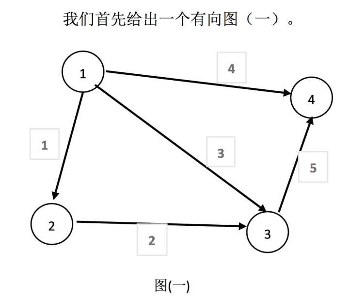
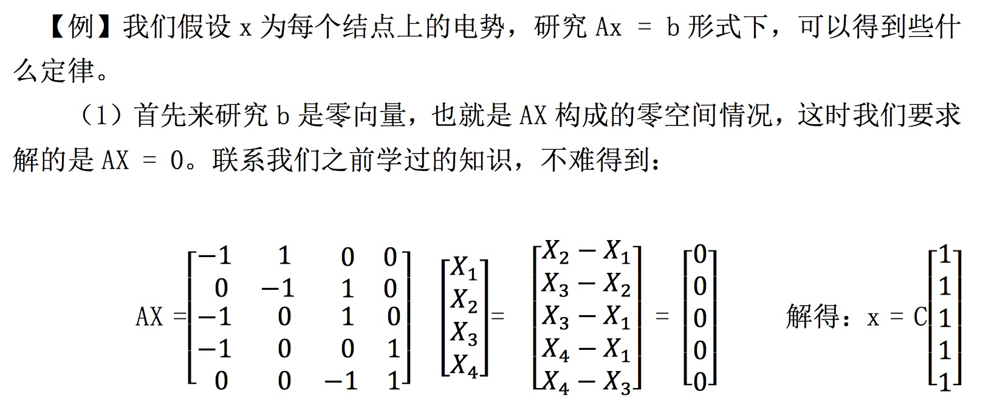
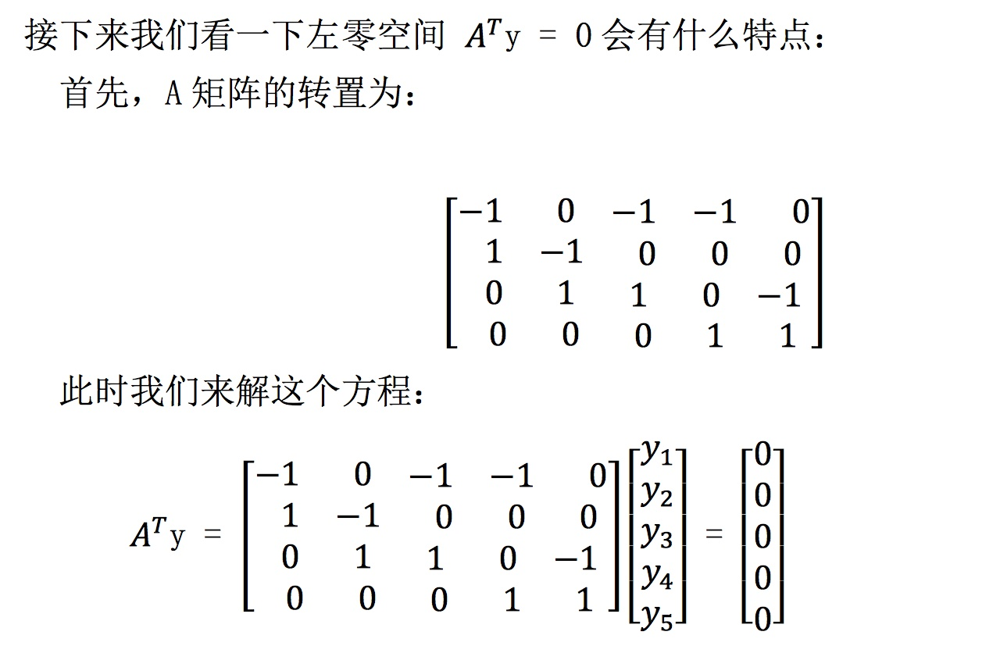
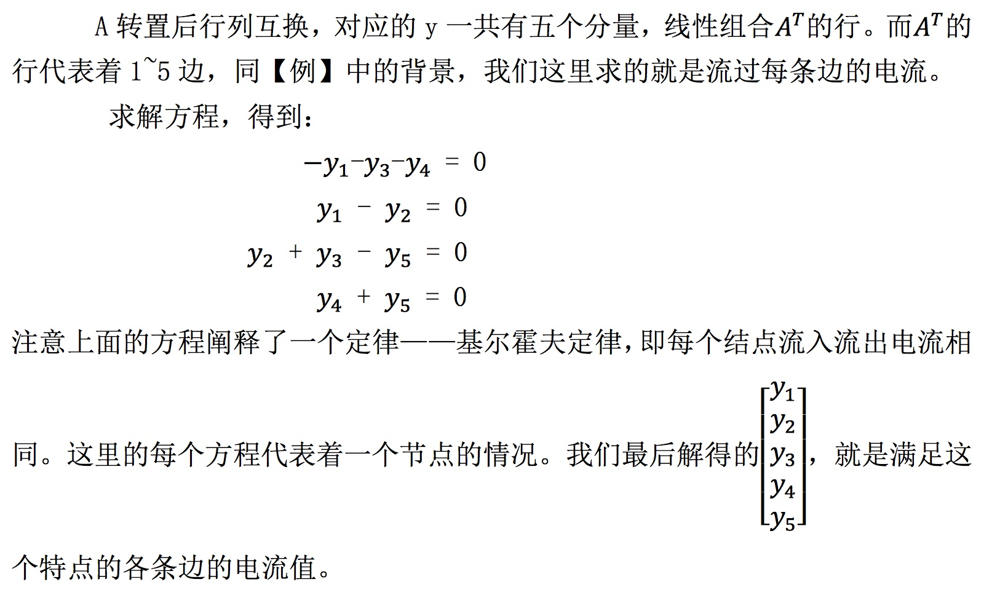
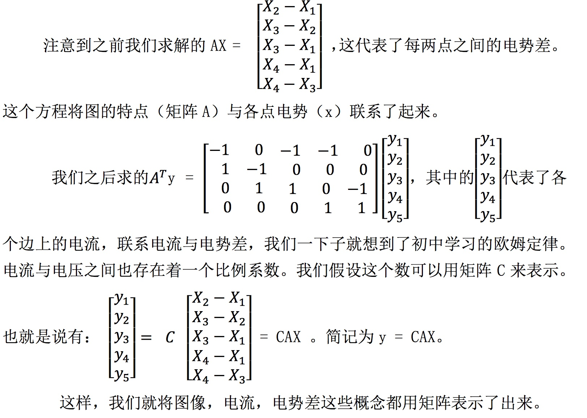
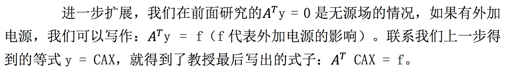

# 12-图和网络

## 1、Overview（概述）

这一节中我们主要介绍图与矩阵之间的关联，利用矩阵来说明图的特点。这一节中与之前几节的区别主要在于，前面例子中的矩阵中的元素大都是为了说明性质编造出来的，而本节中矩阵中的元素都是来源于实际问题，更能体现出我们之前介绍的性质在实际问题中有什么用。

## 2、图和关联矩阵

本节中我们研究的问题都是基于这个有向图来研究的。那么既然是有向图，我们不难写出它的关联矩阵 A 如下：

可能有一些没接触离散数学的人会对关联矩阵不是很熟悉，我在这里简单介绍下，上面 5*4 矩阵中，每一列代表一个节点，比如：第一列代表结点1，第二列代表结点2....以此类推。

而每一行代表的就是一条边的走势，同样，第一行代表边1 第二行代表边2 ...等等。这里需要注意的是，每一行所代表的边，体现在这一行元素上，表现为：该边以哪一个结点为起点，对应的矩阵中该元素为 -1 ，而以哪个结点为终点，对应矩阵中该元素为1 。

很好，我们现在从实际问题中抽象出了一个矩阵，接下来我们来研究图（一）所代表的实际意义。

由于 X 是各个节点上的电势，很明显， X 的解集代表了 b 是 0 时。各点电势必须相等。我们接下来考虑，这代表着什么。

我们都知道，电势差和电流的形成之间有着直接关系，b=0，说明我们求解的情况是各个边上都没有电流（或者说电势差）的情况，而我们最后解得，各点电势相等时，边上电流为 0，符合我们的常识。

(2) b 如果不为 0，那么我们可以通过特解 + 通解的方式求出不同 b 的情况下，方程对应的解。代表这不同的电势差情况，各点电势的大小。

## 3、实际应用的扩展

## 4、小结

可以看到，这一节与我们之前讲的内容联系较多，与实际应用联系也比较大。从一个图出发，联系实际物理问题，解释了如何用矩阵阐述欧姆定律以及基尔霍夫定律的。学习了我们本节的内容之后，我们才算真正明白了之前学习的各种空间具体到实际问题有什么作用。

【[上一章：11-矩阵空间、秩1矩阵和小世界图](../11-矩阵空间-秩1矩阵和小世界图/11-矩阵空间-秩1矩阵和小世界图.md)】【[下一章：13-复习一](../13-复习一/13-复习一.md)】
