# 13-复习——经典题型的解法

## 1、Overview（概述）

这一节是习题课，主要回顾了一下之前学习的内容，需要掌握的一些经典题型的解法。

## 2、例题

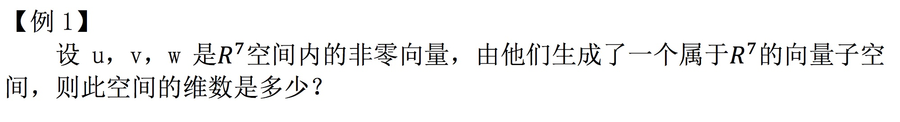

答案：

三个张量张开的空间，很明显维数只能是 0, 1, 2, 3. 本题中维数不可能是 0, 因为题设为非零向量。所以最后答案为： 1, 2, 3.

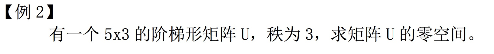

答案：只有零向量。

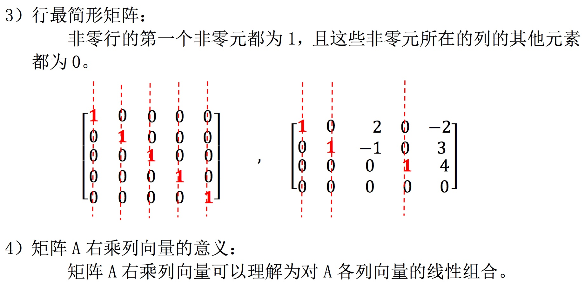

分析本题：

由秩为 3 可知原矩阵的列向量线性无关，也就是没有线性组合能得到零向量，所以其零空间中只有零向量。

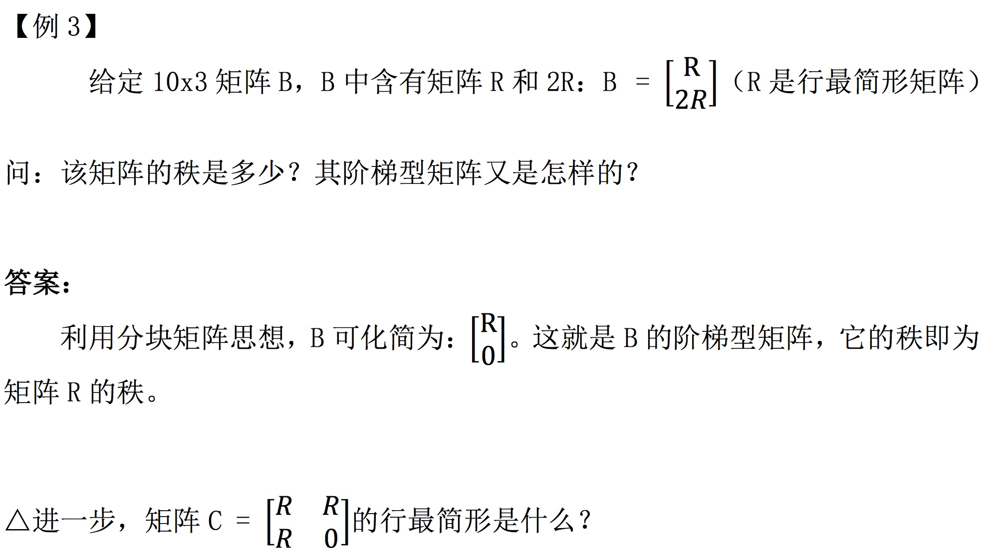

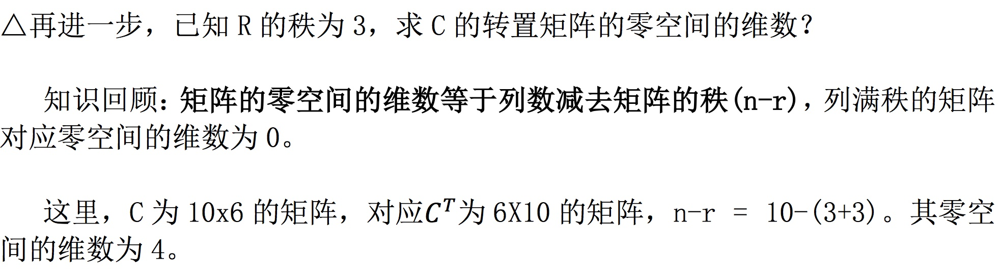

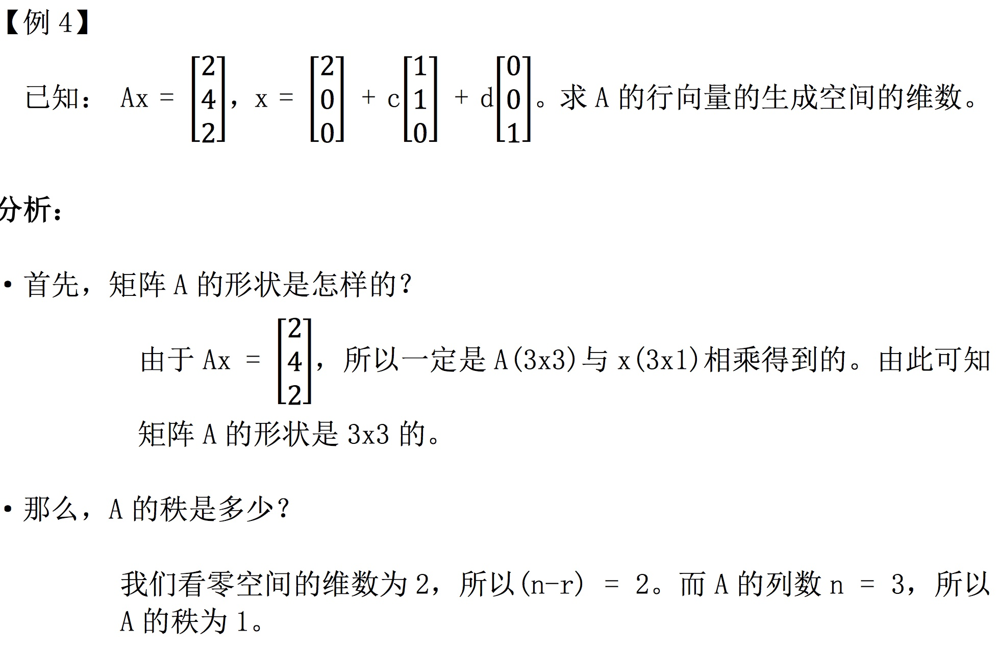

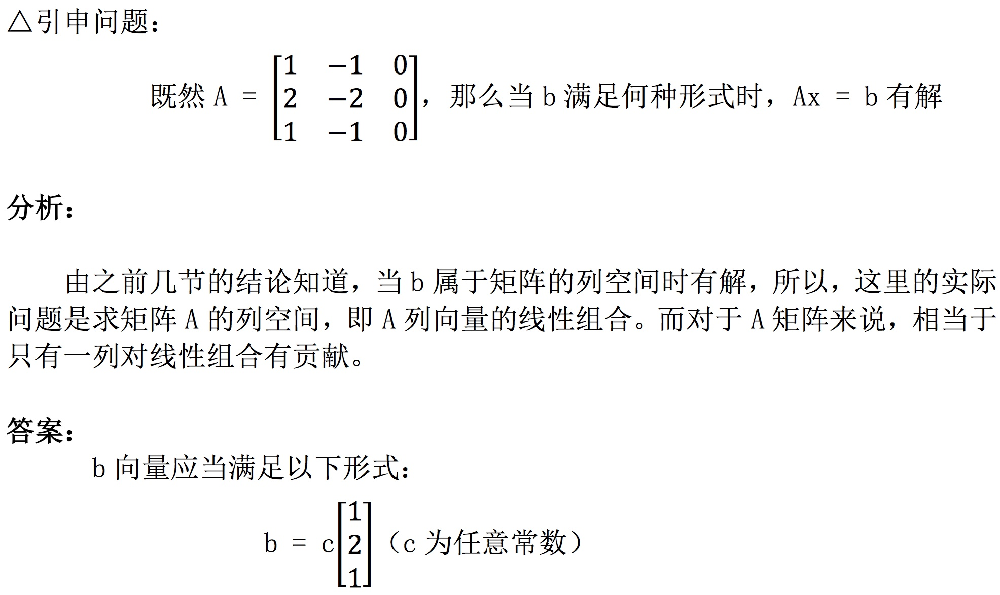

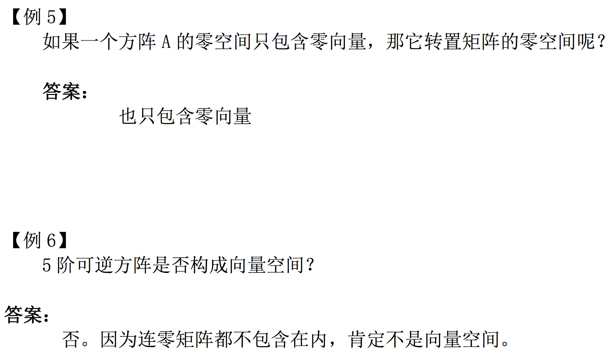

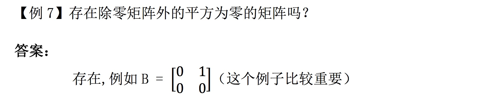

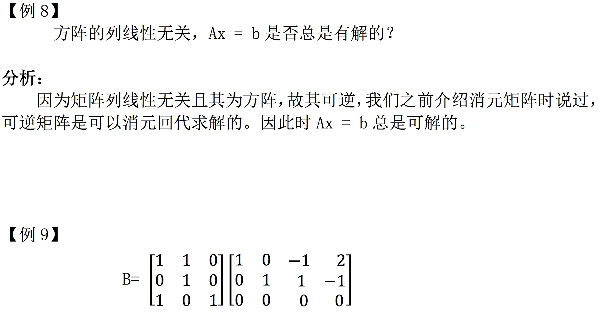

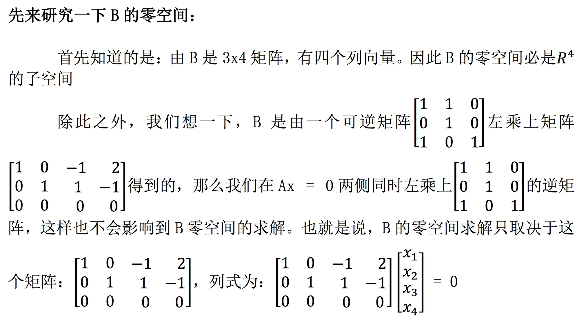

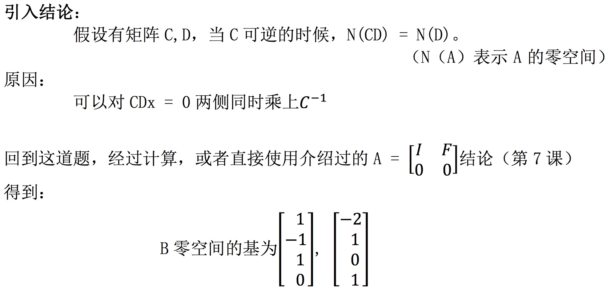

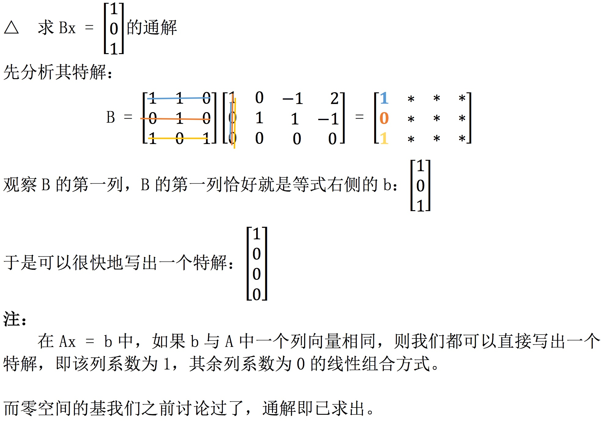

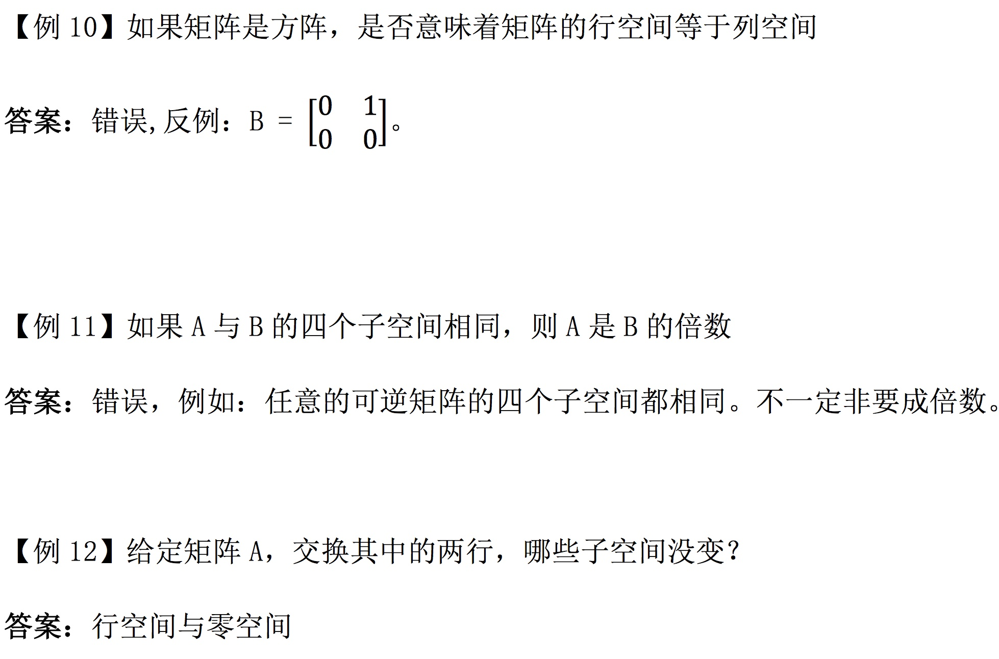

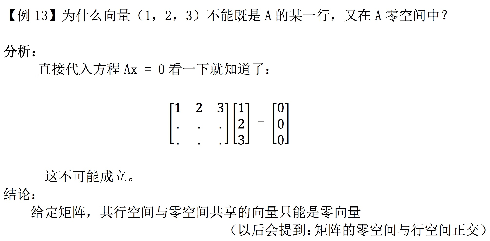

## 3、小结

这一节习题课结束后，线性代数的这一部分基础也差不多结束了，接下来的课程会围绕一些别的东西展开，比如 正交，特征值之类的知识，这一部分是基础，所以，大家一定要打好基础。

【[上一章：12-图和网络](../12-图和网络/12-图和网络.md)】【[下一章：14-正交向量与子空间](../14-正交向量与子空间/14-正交向量与子空间.md)】
