# 换个角度看线性代数（一）

## 1、过往

第一次接触线性代数是在大一第一学期，学完后分数不低，但是结束考试过后就感觉啥都没学到，对线性代数还是那样一个模糊的概念，记忆中只有那零零碎碎的计算公式。真正慢慢理解是毕业之后，参加 [ApacheCN](http://www.apachecn.org) 之后，从头开始学习 **MachineLearning(机器学习)** 的时候，遇到矩阵知识真的是什么都不会。所以私下里偷偷从头学习了一下，也在网上找了好多资料，知道了好多大佬，稍微对线性代数的实质有了一点自己的理解。

## 2、开干

### 2.1、向量

线性代数最基础，最根源的组成部分就是向量，向量的线性组合构成了线性代数的基本运算。下面我们首先介绍向量。

直观上，向量通常被标示为一个带箭头的线段。线段的长度可以表示向量的大小，而向量的方向也就是箭头所指的方向。—— 维基百科

从上面的维基百科的定义中，我们可以得到决定一个向量的是它的长度和它所指的方向共同决定，只要保持着两个量（方向和长度）不变，那么你可以随意移动向量而使它不变。

实际上，向量在科学中的表示，通用的有三种表示，第一种用带有箭头的线段表示，第二种用符号表示，第三种用有序数组表示，它们看似不同，实际上只是向量的不同描述~如下图:

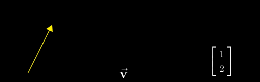

那么问题来了，先上图: 

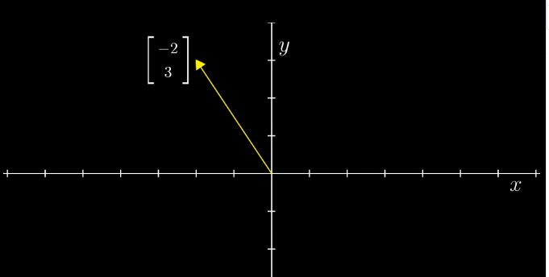

上面我们说到，向量是可以随意移动的，只要方向和长度不变即可，那么如何确定 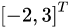 是如何与图上向量一一对应的呢。

答: 在线性代数中，向量的起点往往是以原点开始，那么每一个有序数组都能在坐标系中唯一表示一个向量。

**总而言之，向量就是一个从原点出发的箭头，有着方向和大小。可以用有序数组表示，并且由于默认起点是原点，一个有序数组唯一代表了一个向量。**

### 2.2、空间

首先我们来看一下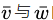的线性组合表示为: 

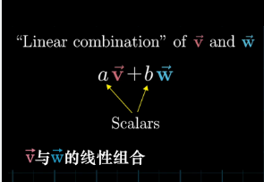

那么下面我们给出空间的定义: 

所有表示为给定向量线性组合的向量的集合被称为**给定向量张成的空间**。我们来考虑两种情况，当 共线与不共线两种情况，它们所张成空间的情况。
* 当不共线的时候，大部分情况还是这样，它们线性组合构成的向量集合是什么？

它们随着俩个向量前面系数的改变，它们张成的空间是所有二维向量的集合（也就是整个二维空间都会被充满）.下面我们来解释一下.

当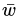 向量前面系数不变，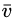 前面系数在实数范围内改变的时候，我们可以得到平行于向量的所有二维向量.如下图：

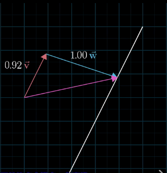

它们组合的向量终点是在白线上（后续会说明为什么向量还可以用一个点表示，其实也很容易理解，起点默认了是原点了）

那么我们可以这样理解，对于每一个 前面系数在实数范围内变化，我们可以看成这条白线往 方向来回平移，这样二维平面内的向量都能被充满.这样也就解释了为什么俩个不共线的向量能够线性组合为所有的二维向量.也就是说，当俩个向量不共线的时候，它们张成的空间是整个二维空间
* 当 与  共线的时候，它们线性组合构成的向量集合（也就是张成的空间是什么）是什么？

当两个初始向量共线的时候，所产生的向量的终点被限制在一条过原点的直线上。

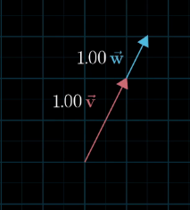

这非常好理解，可以把这两个向量旋转到 x 轴，平行的两个向量，无论你怎样线性组合，组合出的新的向量都是在 x 轴上。**当两个向量共线的时候，它们所张成的空间是平行于  向量的一维直线**。

下面我们来考虑三维的情况，先上图

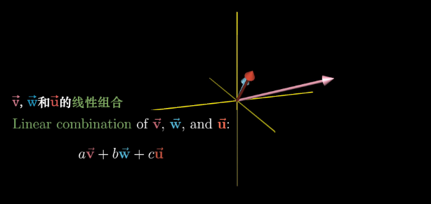

**很显然，我们类比也能得出，当三个向量不共面的时候，它们张成的空间是整个三维空间，当三个向量不共线但是共面的时候，张成的空间是它们形成的二维平面，当他们共线的时候，那么张成的空间就是那条直线.下面我解释一下为什么这样，以便能够更好的推广到高维空间**.

* 三个向量不共面的情况

我们首先可以看在三维空间中两个向量不共线的情况如下: 

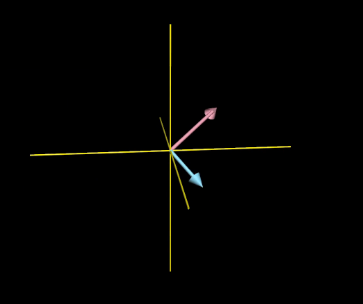

根据我们前面的分析，我们很容易得到，**这两个张成的空间是三维空间中的一个平面**，如下图: 

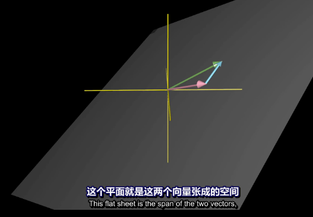

**那么当第三个向量如果在前俩个向量张成的空间内，那么这三个向量张成的空间就是这个平面**

**当第三个向量不在前俩个向量张成的空间内，那么它们三个向量张成的空间是整个三维空间.这又如何思考呢？**

当前俩个向量张成一个空间的时候，第三个向量（下图是红色向量表示）控制了最后张成的空间，可以这里理解：当你缩放第三个向量时，它将前俩个向量张成的平面沿它的方向来回移动，从而扫过整个空间.over！这就解释了它们三个向量张成的空间是整个三维空间，下图显示：

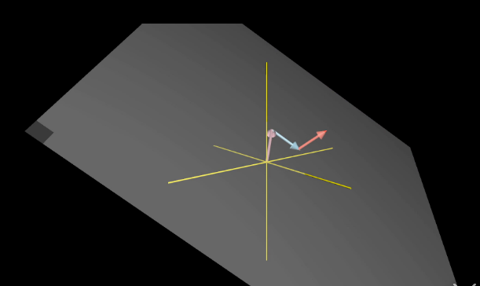

**当第三个向量（红色向量).上下移动的时候，前俩个向量构成的空间沿着这个向量方向移动，从而扫过整个空间.最后解释一下三个向量共线的情况，张成的空间就是那条直线上的一维空间**.由于我们生活在三维空间中，四维以上的空间我们无法想象到，可以通过类比上去，这也是线性代数的一个很重要的思想.

* 为什么有时候向量可以用点来表示

想象落在一条直线上的一些向量的时候，你会觉得比较拥挤

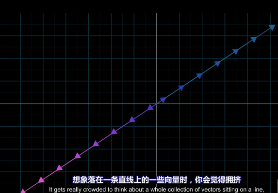

同理想象所有二维向量填满平面时，你会觉得非常拥挤

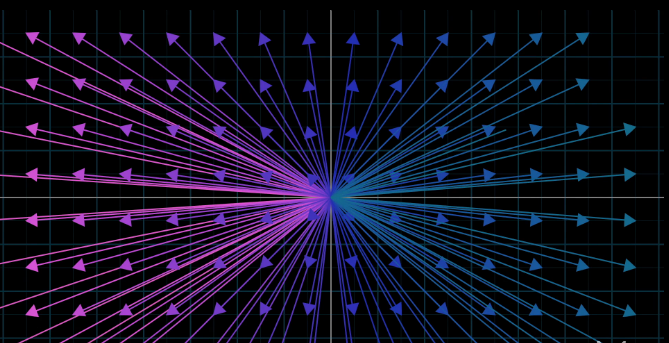

**所以为了对付这种情况，通常我们就用向量的终点来代表该向量**，如下图：

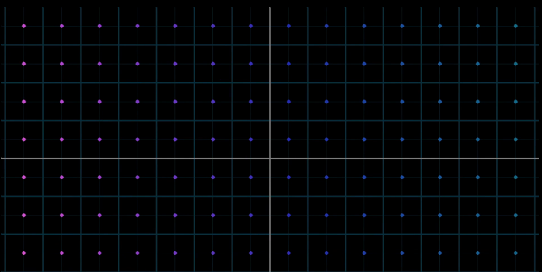

这也就解释了为什么向量有时可以用点来表示~